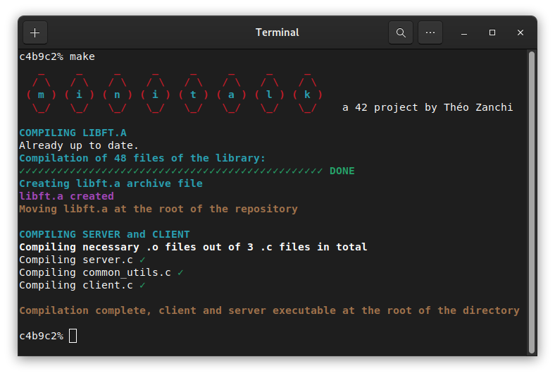
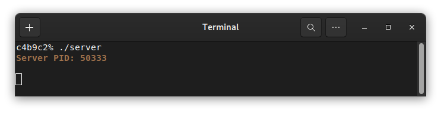
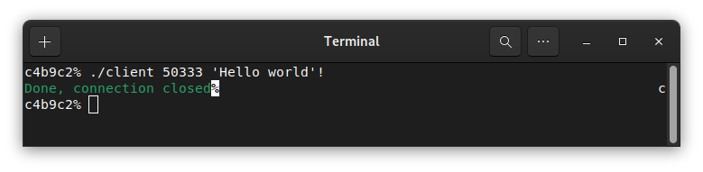
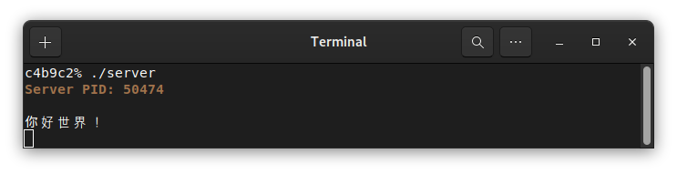
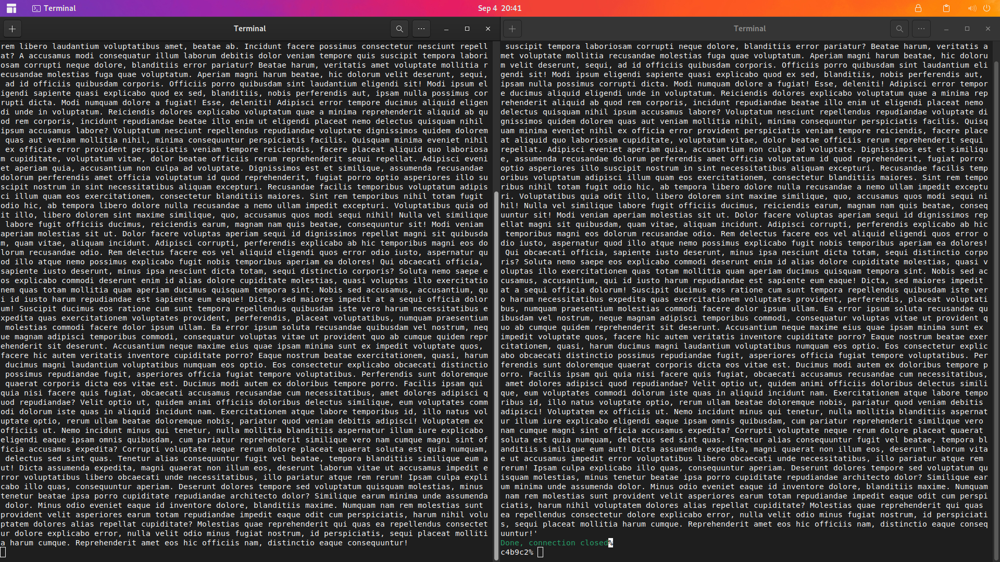

   

# Minitalk

This project is about creating a simple client/server program. Both programs can only communicate through `SIGUSR1` and `SIGUSR2` POSIX signals.
The client encodes each bit of the message and uses `SIGUSR1` to send 0s to the server, and `SIGUSR2` to send 1s. The server accumulates the received bits and stores each byte received into a temporary buffer.
Once a null-terminator `\0` has been received by the server, it prints the message and sends `SIGUSR2` back to the client to close communication. Unicode characters are supported by both client and server.

The full subject can be found [here](.media/en.subject.pdf).

# Downloading and compiling the project

Clone the library and use `make` to compile
```
git clone https://github.com/theozanchi/42_Berlin_minitalk/tree/main
cd 42_Berlin_minitalk
make
```



# Running the program

Launch the server first
```
./server
```
It displays its process ID:


Then messages can be sent from the client:


Unicode characters are supported on both sides:


A message of any size can be passed (examples of 1000 words of Lorem Ipsum):

